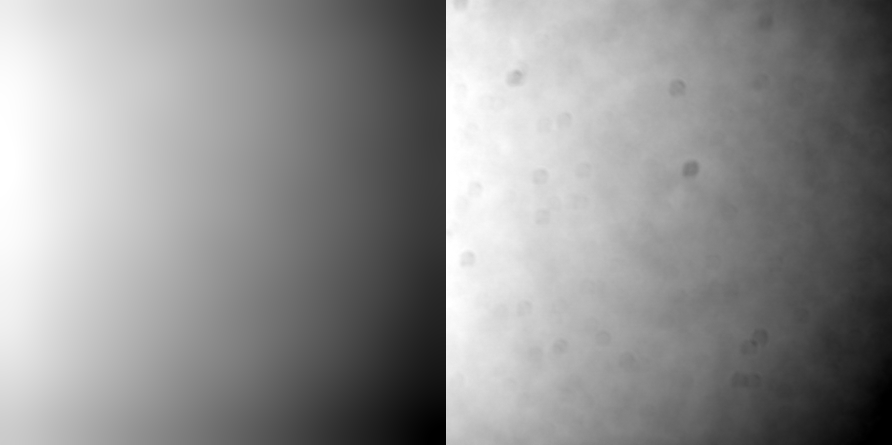
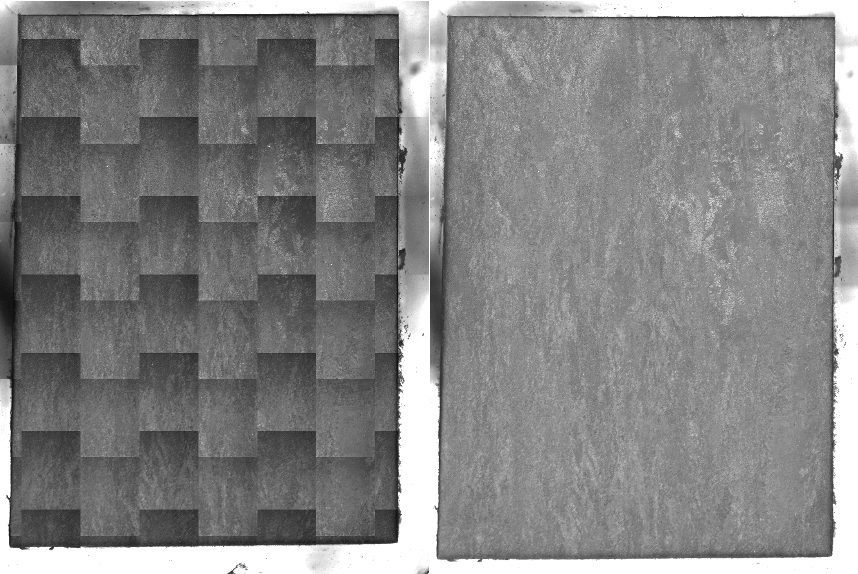

# Tiles

## Overview

Tiles are essential components in the analysis of large-scale imaging data, particularly in the context of microscopy. They represent smaller, manageable sections of a larger image or dataset, allowing for efficient processing and analysis. In this section, we will explore how tiles can be extracted from CZI files and the significance of TileRegions and TileArrays in defining these tiles during experiments.

## Extracting Tiles from CZI Files

CZI (Carl Zeiss Image) files are a common format used to store multi-dimensional imaging data.

We rely on the [PyLibCZI from Allen Institute for Cell Science (AICS)](https://allencellmodeling.github.io/aicspylibczi/index.html), built on top of [libCZI from Zeiss](https://github.com/ZEISS/libczi).

| Dimensions Defined in libCZI | Dimensions Added by AICS PyLibCZI        |
| ---------------------------- | ---------------------------------------- |
| **V** - View                 | **M** - Mosaic Tile (Mosaic Images Only) |
| **H** - Phase                | **Y** - Image Height                     |
| **I** - Illumination         | **X** - Image Width                      |
| **S** - Scene                | **A** - Samples                          |
| **R** - Rotation             | **B** - BGR/RGB Images Only              |
| **T** - Time                 |                                          |
| **C** - Channel              |                                          |
| **Z** - Z Plane (Height)     |                                          |

In practice, the image data we are interested in from serial sectioning rely on the SCMYX structure.

### Table of CZI Tile Data Structure {#tile-info}

| TileRegion vs. TileArray                       | Dimensions                                                              |
| ---------------------------------------------- | ----------------------------------------------------------------------- |
| TileRegion, single channel, 4 individual tiles | [{'X': (0, 896), 'Y': (0, 896), 'C': (0, 1), 'M': (0, 4), 'S': (0, 1)}] |
| TileArray, single channel, 32 individual tiles | [{'X': (0, 4512), 'Y': (0, 4512), 'C': (0, 1), 'S': (0, 32)}]           |

## TileRegions and TileArrays

During the experimental setup, tiles are defined in terms of TileRegions and TileArrays. The differ slightly in terms of definition and are determined during data collection. precon3d attempts to differentiate and automatically process either of these formats.

### TileRegion

A TileRegion uses a grid layout: Tiles are arranged in a rigid, rectangular grid format. In this case, the tile data in structured using the **M** mosaic tile dimension, see [Table of CZI Tile Data Structure](#tile-info).

### TileArray

A TileArray uses tile coordinates: The tile's location in space is specified and doesn't need to be a rigid, rectangular grid. In this case, the tile data in structured using the **S** scene dimension, see [Table of CZI Tile Data Structure](#tile-info).

## Shading Correction

In some cases a shading (aka background) correction is necessary.

_Figure above is an example shading correction. (left) a smoothed result using [BaSiC](https://github.com/marrlab/BaSiC). (right) a background estimated with non-negative matrix factorization._

_Figure above is a stitched mosaic *without* shading correction applied to tiles (left) vs. a stitched mosaic *with* shading correction applied to tiles (right). The sample shown here is an Additive Mannufactured Titanium alloy imaged with Polarized Light Microscopy._

## Conclusion

Tiles play a crucial role in managing large imaging datasets. By extracting tiles from CZI files and understanding the concepts of TileRegions and TileArrays, the next section [Mosaics](3_mosaic.md) will build on these ideas.
