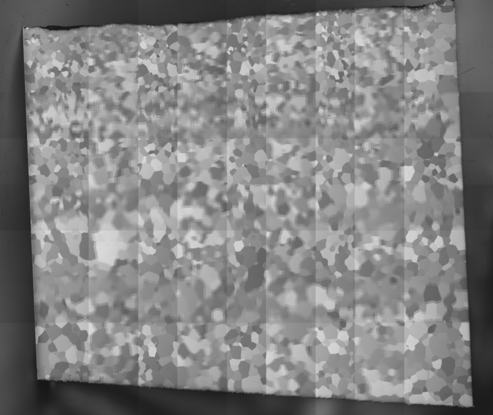
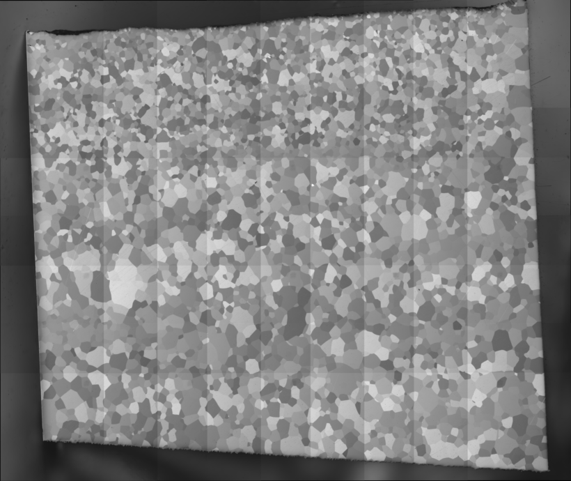
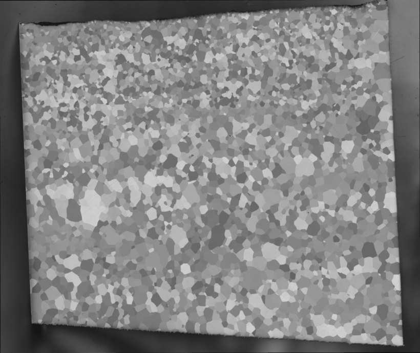

# Mosaic

## Overview

The mosaic is the collection of [Tiles](2_tiles.md) that together form a comprehensive representation of a larger image or dataset. Each tile contributes to the overall mosaic, allowing for detailed analysis of a specific region of interest.

### Tile Alignment

To create a seamless mosaic, the tiles must be accurately aligned. This alignment process typically utilizes the overlap between adjacent tiles, which is usually around 30% at the edges of the images. This overlap ensures that there is sufficient information to accurately stitch the tiles together, minimizing gaps and misalignments in the final mosaic. We found Preibisch (2009) [Grid Stitch Plugin for ImageJ](https://imagej.net/plugins/grid-collection-stitching) performs well. We made some modification to run the plugin either as a python subprocess or run the pariwise registration in python.

The below example from an alpha Ti7Al alloy images with Polarized Light Microscopy illustrates this concept. This mosaic is composed of 20 individual tiles (4 rows by 5 columns).

{#stitched-tiles}
_Mosaic with original positions. The tiles placed in a mosaic with the original tile positions recorded by the stage during image. Note the regions of overlap are blurred since each tile is misaligned with respect to its neighboring tile._

{#stitched-tiles}
_Mosaic with corrected positions. The tiles placed in a mosaic with updated tile positions after stitching alignment. Note there is no blurring between indivdual tiles._

{#stitched-tiles}

_Mosaic with blended with corrected positions. The tiles have been blended at the edges for seamless mosaic with no edge artifacts from the indivual tiles._

## Stitcher

**stitcher** handles the operation of aligning a set of overlapping tiles into a large montage. The stitcher performs the following functions shown in the [figure above](#stitched-tiles):

1. **Image Stitching**:
   The stitcher identifies corresponding features in overlapping tiles to determine their alignment. This process involves computing phase correlation. If this fails, it is often due to inadequate overlap or a lack of matching features of interest in the images.

2. **Blending**:
   Once the tiles are stitched, the edges must be blended with their neighbors to create a smooth transition. The intensity in the overlapping areas is gradually adjusted between the two images. This process helps eliminate visible seams and artifacts that may arise from the stitching.

By effectively managing the alignment and blending of tiles, `stitcher` plays a vital role in producing high-quality mosaics that accurately represent the underlying data.

### References

Preibisch, S., Saalfeld, S., & Tomancak, P. (2009). Globally optimal stitching of tiled 3D microscopic image acquisitions. _Bioinformatics_, 25(11), 1463–1465. [doi:10.1093/bioinformatics/btp184](https://doi.org/10.1093/bioinformatics/btp184)
