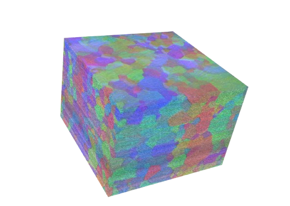

# Conclusion

This `precon3d` package provides routines for turning mechanical serial sectioning data into useful volume information.

`precon3d 🧊 -- (PRE)pare serial sectioning montage data for (RECON)struction in (3D)`

It leverages open-source Python libraries to facilitate the reconstruction of data from large field-of-view microscopy image stacks. By utilizing these tools, users can efficiently analyze and visualize complex data, enhancing their understanding of the underlying biological structures.

The `precon3d` package represents our efforts for integration of imaging data processing and analysis, making it easier for scientists to derive meaningful insights from their experiments.
